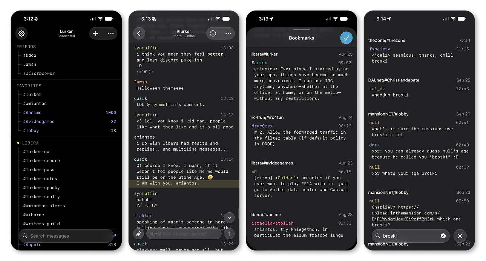

# Lurker for iOS

The native iOS and iPadOS client for [Lurker](https://github.com/amiantos/lurker) — a beautiful self-hosted IRC client for you and your friends.

## Servers and push

Works with any Lurker server, self-hosted or [lurker.chat](https://lurker.chat). Push notifications are built in on lurker.chat. For a self-hosted server, the admin turns them on under **Admin → Notifications** with [push.lurker.chat](https://push.lurker.chat), a paid relay; see [the self-hosting guide](https://docs.lurker.chat/SELF_HOSTING#push-and-the-mobile-apps).

## Beta Test

Join the beta on [TestFlight](https://testflight.apple.com/join/tteEzxHe)!

## Screenshots

## License

[MPL-2.0](LICENSE), same as Lurker.
